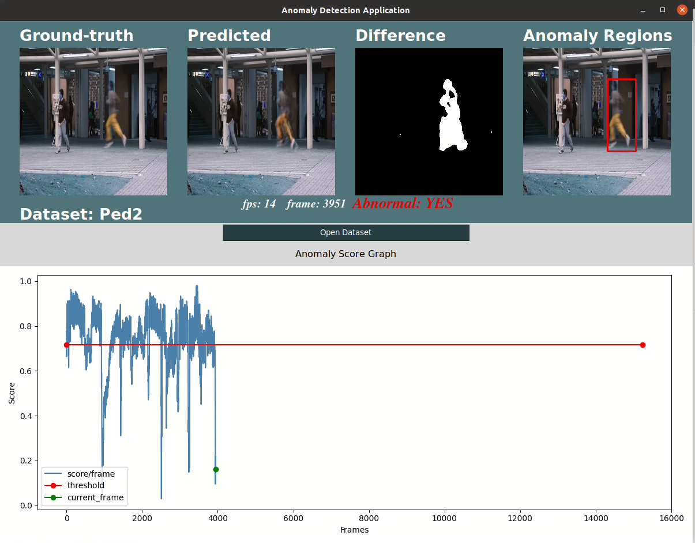

  

---

---

### 🚀 About Me
**I bridge the gap between Hardware and Intelligence.**
As a Software Engineer specializing in **Embedded Systems** and **Applied AI**, I build systems that are both robust and smart. My expertise spans from low-level **C/C++** and **Linux** optimizations to deploying **Computer Vision** and **LLM/RAG** solutions. I focus on precision, clarity, and bringing intelligence to the edge.

 
   

- 🔭 I’m currently working on **High-Performance IP Camera Systems**.
- 🌱 I’m currently exploring **Applied AI in Embedded Systems**.
- 💬 Ask me about **Embedded C, IoT Protocols, and Multimedia Pipelines**.

---

---

### 🛠️ Tech Stack & Arsenal

| Core Languages | Embedded & System | DevOps & Tools | Protocols | AI & Data |
| :--- | :--- | :--- | :--- | :--- |
|        |        |        |        |        |

---

### 📂 Private Engineering Showcase

#### 1. 📡 AmpacsSDK: Modular IoT Framework
> **Role**: Core SDK Developer | **Focus**: System Integration, MQTT, HAL
>
>  
>
> 🛠️ **Stack**:    
>
> 📝 **Description**: A modular IoT Framework SDK designed for embedded devices, providing backend-agnostic MQTT connectivity, portable HAL abstractions, and dynamic command handling.

**Key Engineering Contributions**:
*   🧩 **Backend-Agnostic Architecture**: Decoupled the MQTTS library from Paho/EMQX using opaque handles and weak symbols, allowing seamless backend switching.
*   🌙 **Portable Day/Night SDK**: Designed a HAL-based `dnm_api` module that abstracts hardware specifics, enabling standard integration across different chipsets.
*   ⚡ **Dynamic Command Handling**: Implemented a callback manager system for runtime registration of custom MQTT command handlers.

---

#### 2. 🎥 IP_Cam: High-Performance AV Pipeline
> **Role**: Core System Engineer | **Focus**: WebRTC, LiveKit, Day/Night Mode
>
>  
>
> 🛠️ **Stack**:     
>
> 📝 **Description**: A high-performance audio/video pipeline supporting Day/Night mode HAL architecture. Features low-latency Opus audio integration and modern real-time streaming via WebRTC and LiveKit.

**Key Engineering Contributions**:
*   🌐 **Real-Time Streaming**: Built low-latency A/V transmission streams utilizing **WebRTC** and **LiveKit** protocols.
*   🔊 **Low-Latency Audio**: Integrated Opus codec and restored the full **Resampler → Mixer → Playback** pipeline.
*   🌙 **Day/Night Mode (DNM)**: Engineered the core HAL and State Machine for seamless ISP/IR-Cut transitions, managing low-level hardware logic autonomously.

---

#### 3. 🌐 Onvif: Interoperability Standard
> **Role**: Protocol Engineer | **Focus**: Profile S/T, SOAP, System Services
>
>  
>
> 🛠️ **Stack**:    
>
> 📝 **Description**: Implementation of ONVIF Profile S/T standards for IP Cameras, ensuring interoperability through reliable SOAP services for imaging and system management.

**Key Engineering Contributions**:
*   🖼️ **Imaging Service Reliability**: Resolved critical profile lookup bugs in `GetImagingSettings` and synchronized IR cut filter state between ONVIF, ISP, and NVRAM.
*   🕒 **Time Synchronization**: Implemented `SetSystemDateAndTime` compliant with ONVIF specs using precise `clock_settime` syscalls.

---

#### 4. 🔐 SSL-FFPlayer: Secure Media Playback
> **Role**: Multimedia Engineer | **Focus**: FFmpeg, SDL, OpenSSL
>
>   
>
> 🛠️ **Stack**:    
>
> 📝 **Description**: A secure, low-latency media player built with FFmpeg and SDL, optimized for synchronized audio/video playback over encrypted SSL streams.

**Key Engineering Contributions**:
*   ⏱️ **A/V Synchronization**: Re-engineered sync logic to slave video frames to the audio master clock, achieving lip-sync accuracy for low-latency streams.
*   🔒 **Secure Streaming**: Integrated Client Certificate authentication directly into the FFmpeg transport layer.

#### 5. 🤖 R-MCAL Chatbot: AUTOSAR Assistant
> **Role**: Personal Project | **Focus**: RAG, LLM Optimization, Deployment
>
>  
>
> 🛠️ **Stack**:        
>
> 📝 **Description**: An intelligent RAG-based chatbot assistant trained on complex AUTOSAR MCAL specifications to answer technical queries and accelerate development.

**Key Engineering Contributions**:
*   🧠 **RAG System**: Built a Retrieval-Augmented Generation pipeline to query complex **AUTOSAR** MCAL specifications.
*   ⚡ **Optimization & Research**: Researched and optimized model performance for domain-specific technical documentation.
*   🚀 **Deployment**: Managed end-to-end deployment of the chatbot assistant.

#### 6. 🚗 Renesas OTA: FOTA Installer (Former Company)
> **Role**: Embedded Software Engineer | **Focus**: SOTA/FOTA, Xen Hypervisor, Reliability
>
>  **[Renesas Design Vietnam]**
>
> 🛠️ **Stack**:    
>
> 📝 **Description**: Developed a fail-safe Firmware Over-The-Air (FOTA) installer for Spider S4/S4N automotive boards, managing eMMC/Flash updates with automatic fallback and cloud triggering.

**Key Engineering Contributions**:
*   🔄 **Fail-Safe Updates**: Implemented a robust fallback mechanism to revert firmware to a previous stable version upon update failure.
*   📦 **Binary Frame Design**: Designed a custom data frame protocol for secure reliability verification (checksum, length, data) of update binaries.
*   🚦 **Dual Memory Support**: Engineered the installer to support both eMMC and Flash memory targets.
*   📜 **Automation**: Wrote comprehensive Shell scripts to orchestrate the update process seamlessly on Linux/Xen environments.

---

### 🌟 Personal, Freelance & Academic

#### 7. 🏥 ClinicPRO: Clinic Management Platform (Freelance)
> **Role**: Full Stack Developer | **Focus**: Flask, HTMX, Chart.js, Medical Charts
>
>   
>
> 🛠️ **Stack**:     
>
> 📝 **Description**: A scalable, full-featured web platform for end-to-end clinic operations, handling patient management, automated billing, and interactive medical charting.

**Key Engineering Contributions**:
*   🌐 **Web Architecture**: Architected a robust **Flask** and HTMX-based web application featuring role-based authentication (Owner, Doctor, Receptionist) and dynamic system catalogs.
*   🦷 **Clinical Modules**: Engineered interactive **Dental Charts** (SVG), Kanban-style appointment boards, and comprehensive treatment/prescription tracking with dynamic pricing catalogs.
*   📊 **Automated Operations**: Implemented smart record importing via **PaddleOCR**, rich interactive analytic dashboards using Chart.js, dynamic PDF financial reporting, and daily automated cloud syncing.

#### 8. 🧠 Video Anomaly Detection (Collaboration)
> **Role**: AI Engineer (Co-Author) | **Focus**: Computer Vision, Evaluation Logic
>
>  
>
> 🛠️ **Stack**:    
>
> 📝 **Description**: Collaborated research on detecting anomalies in surveillance video, focusing on pixel-level evaluation metric implementation and parameter tuning.
>
> 🔗 **Remote Repo**: [anhhuu/anodetection-aemem](https://github.com/anhhuu/anodetection-aemem)

**Key Engineering Contributions**:
*   📉 **Pixel-Level Eval**: Implemented fine-grained evaluation metrics for anomaly localization.
*   ⚙️ **Optimization**: Tuned Image Difference thresholds to improve detection rates on the **UCSD Ped2** dataset.

#### 9. 🔢 Big Number: C++ High-Precision Library (Academic)
> **Role**: Academic Project | **Focus**: QInt/QFloat, Operator Overloading, Calculator
>
> 🛠️ **Stack**:  
>
> 📝 **Description**: A C++ library implementing 16-byte `QInt` and `QFloat` data types to handle numbers exceeding standard limits, featuring a calculator application demonstration.
>
> 🔗 **Remote Repo**: [LahyUS/Big-Number](https://github.com/LahyUS/Big-Number)

---

### 📫 Connect with Me

  
   
  <b>📧 Email: lahyus7399@gmail.com</b>
   
  <b>📞 Phone: (+84) 836 476 472</b>

  

